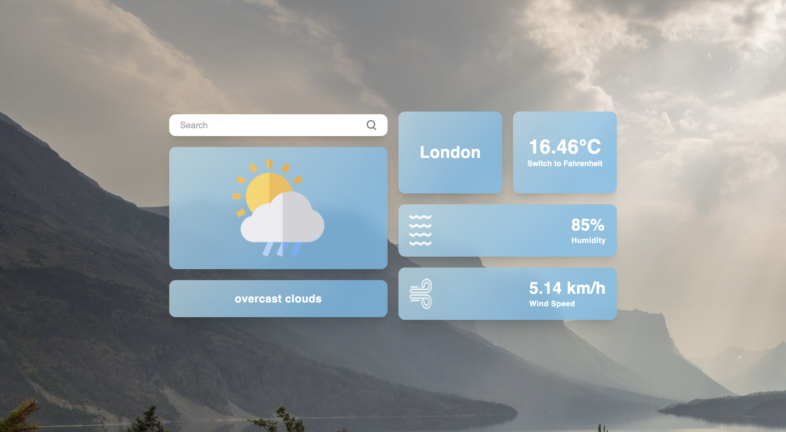

# [Weather App](https://weather-app-reactjs-19.vercel.app/)

 

This is a simple weather application built using React. It allows users to search for weather information for a specific location and provides details such as temperature, humidity, wind speed, and weather description.

## Features

- **Search**: Enter the name of a city to search for weather information.
- **Temperature Unit Toggle**: Switch between Celsius and Fahrenheit units for temperature display.
- **Weather Icon**: Displays an appropriate weather icon based on the current weather conditions.

## Getting Started

To get started with this application, follow these steps:

1. Clone the repository to your local machine:

   ```bash
   git clone <repository-url>
   ```

2. Navigate to the project directory:

    ```bash
    cd weather-app
    ```
3. Install the required dependencies:
    ```bash
    npm install
    ```
4. Obtain an API key from OpenWeatherMap:

- Visit [OpenWeatherMap](https://openweathermap.org/api) and sign up for a free account.
- Generate an API key from your account dashboard.

5. Replace the apiKey variable in the WeatherApp.js file with your API key:
    ```javascript
    const apiKey = 'your-api-key-here';
    ```
6. Start the deployment server:
    ```bash
    npm start
    ```
7. Open your web browser and navigate to http://localhost:3000 to use the app.

## Usage

- Enter the name of a city in the search input field and click the search icon.
- Weather information for the specified location will be displayed, including temperature, humidity, wind speed, and weather description.
- Click the "Switch to Celsius" or "Switch to Fahrenheit" button to toggle between temperature units.

## Technologies Used

- React
- JavaScript
- TailwindCSS

